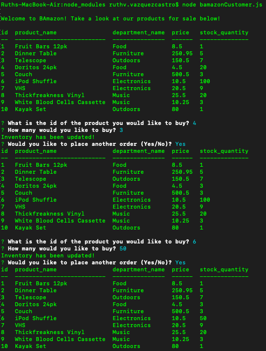

# bamazon

#Notes
This app BAmazon is a using a MySQL database and node to query the database and place orders using prompts, user input, and updating tables.

In this image the app is fully working, 
-The item quantaty gets updated everytime a purchase is made
-The user is prompted with the question if they want to place another order
-The user is then taken to the products table
-Once user dosen't want to place another order, it gets an alert that will then end the app.

