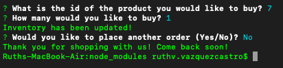

# bamazon
BAmazon is a command line app that allows users to purchase from the inventory provided to them. 

## Usage
```bash
node bamazonCustomer.js
```


## Screenshots of the working app



## License
[MIT](https://choosealicense.com/licenses/mit/)
